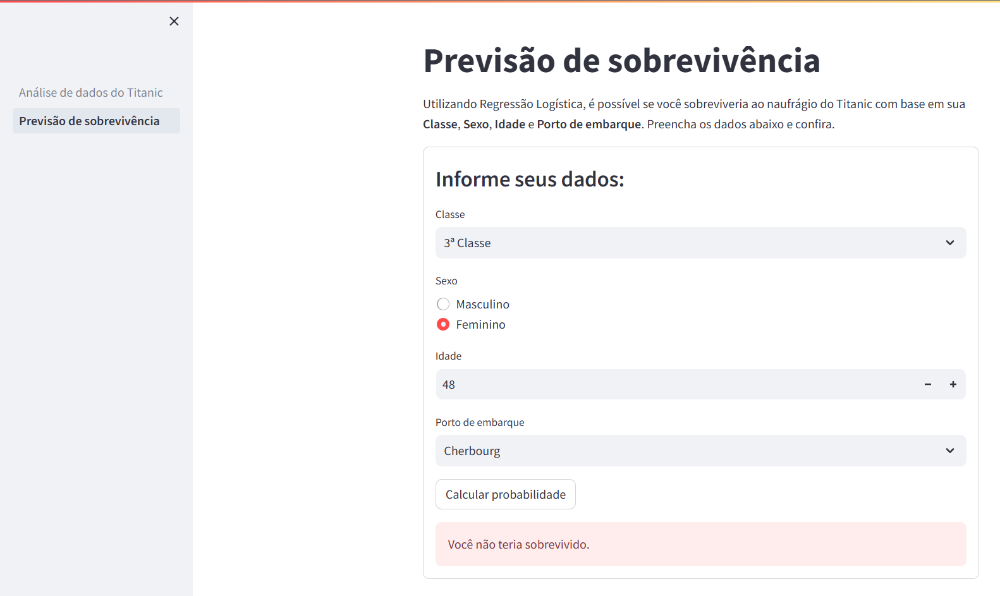

# Titanic Data Visualization & Survival Prediction

This project is an interactive data visualization and machine learning app built with Streamlit. It analyzes the Titanic dataset, allowing users to explore the data and predict passenger survival using a trained model. The app includes:

- Exploratory data analysis with visualizations.
- Survival prediction based on user input.
- Intuitive, interactive interface.

## Try the app online

You can try the app [here](https://stevillis-titanic-data-viz.streamlit.app/).



## How to Use

- The main page provides an overview and visual exploration of the Titanic dataset.
- Use the sidebar to navigate between pages (data analysis, survival prediction).
- On the prediction page, enter passenger details to get a survival probability prediction.

## How to run locally

1. **Clone the repository** and navigate to the project folder.
2. **Install dependencies** (preferably in a virtual environment):

   ```bash
   pip install -r requirements.txt
   ```

3. **Run the Streamlit app:**

   ```bash
   streamlit run 1_Análise_de_dados_do_Titanic.py
   ```

   You can also explore additional pages in the `pages/` directory.
